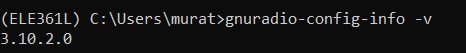

[](https://classroom.github.com/a/h8vpnDAN)
# Week-2

ELE361L 2024-2025 Fall Term Week-2 Repository

In this week, you have two tasks, one for week-2 and another one for week-3 prelab. 

## Week-2 Tasks
For week-2 tasks, check out the notebook in this repo to complete the tasks assigned to you. Then upload your notebook pushing your repository.

## Week-3 PreLab Task
For prelab week-3 task, make sure you have installed GNU Radio properly. And complete your prelab task outlined below.

To use GNU Radio first start a new miniforge prompt, then activate ELE361L environment we have created before, run GNURadio Companion.
```
conda activate ELE361L
gnuradio-companion
```
You can also use start menu item titled "GNU Radio Companion" in a Windows machine.

Now, create a new markdown file named "PreLab3.md". Edit this file so that it has H1 heading titled "Week-4 PreLab", and gnuradio version as its content. You can find the version of gnu radio running `gnuradio-config-info -v` in miniforge prompt. See below my screenshot to see how I obtained this info.



Good luck 😃
